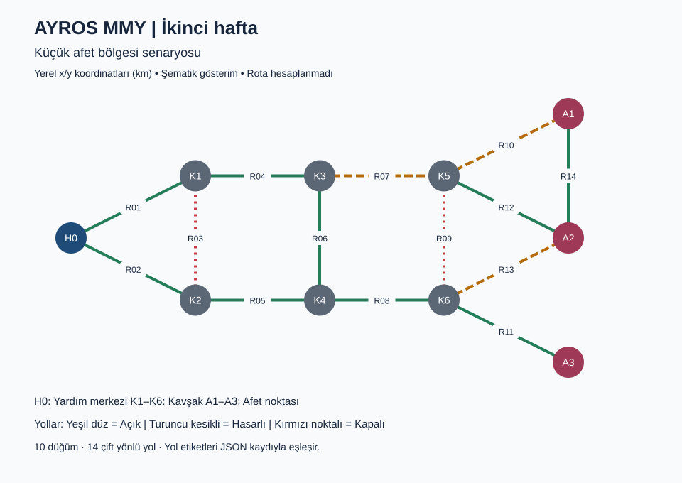

<h1 align="center">AYROS MMY</h1>
<p align="center">Afet Yardım Rota Optimizasyon Sistemi</p>

AYROS MMY, simüle edilmiş afet bölgelerinde yardım araçlarının yol koşulları ve ihtiyaç öncelikleri dikkate alınarak yönlendirilmesi amacıyla geliştirilecek bir akademik projedir. Dijkstra ve A* algoritmalarıyla rota hesaplama, değişen yol koşullarına göre yeniden planlama ve temel düzeyde çoklu araç görev dağıtımı hedeflenmektedir.

> **Proje durumu — 2. hafta:** İlk çizge modeli, JSON senaryo okuma, veri doğrulama, komşuluk sorguları ve statik SVG gösterimi tamamlandı. Rota algoritmaları, hasar maliyeti, araç atama ve hareket simülasyonu henüz geliştirilmedi. Aşağıdaki genel kapsam bu sonraki hedefleri de içerir.

## Proje Hakkında

Afet sonrasında yolların hasar görmesi veya ulaşıma kapanması, yardım araçlarının afet noktalarına erişimini güçleştirebilir. AYROS MMY kapsamında, bu koşulların simüle edildiği bir yol ağı üzerinde yardım araçları için uygun rotaların hesaplanması planlanmaktadır.

Afet bölgesi **ağırlıklı çizge (weighted graph)** olarak modellenecektir. Kavşaklar, yardım merkezleri ve afet noktaları düğümleri; bu noktaları birbirine bağlayan yollar ise kenarları oluşturacaktır. Her yol için mesafe, tahmini geçiş süresi ve yol durumu gibi bilgiler tutulacaktır.

## Projenin Amacı

Projenin amacı, yardım araçlarının yönlendirilmesinde yalnızca en kısa mesafeyi değil; yol durumunu, tahmini seyahat süresini ve afet noktalarının aciliyetini de dikkate alan bir sistem geliştirmektir.

Bu doğrultuda yol koşullarının rota maliyetine yansıtılması, afet noktalarının ihtiyaçlarına göre önceliklendirilmesi ve araçların uygun hedeflere atanması hedeflenmektedir. Önceliklendirme ve görev dağıtımı hedef seçimini destekleyecek; rota algoritmaları ise seçilen hedefe ulaşmak için tanımlanan yol maliyetleri üzerinden çalışacaktır.

## Planlanan Özellikler

- **Çizge tabanlı afet simülasyonu:** Kavşak, yardım merkezi ve afet noktalarından oluşan bir yol ağı oluşturulması.
- **Yol bilgilerinin tutulması:** Her yolun mesafesinin, tahmini geçiş süresinin ve açık, hasarlı veya kapalı olma durumunun modellenmesi.
- **Yol koşullarına duyarlı maliyet hesabı:** Kapalı yolların rota hesabından çıkarılması ve hasarlı yolların rota maliyetinin artırılması.
- **İki rota algoritması:** Dijkstra ve A* algoritmalarının uygulanması ve karşılaştırılması.
- **Sezgisel rota arama:** A* için modelin uygun olduğu durumlarda Öklid uzaklığı gibi sezgisel yöntemlerin değerlendirilmesi.
- **Dinamik yeniden planlama:** Yol kapanması veya maliyet değişimi durumunda ilgili rotaların yeniden hesaplanması.
- **Afet noktalarının önceliklendirilmesi:** Yaralı sayısı, afetzede sayısı ve aciliyet seviyesi gibi verilerin değerlendirilmesi.
- **Temel görev dağıtımı:** Birden fazla yardım aracının uygun afet noktalarına atanması.
- **Senaryo üretimi:** Farklı düğüm ve yol sayıları, kapalı veya hasarlı yol oranları, araç sayıları ve afet öncelik seviyeleri içeren senaryolar hazırlanması.
- **Performans analizi:** Rota maliyeti, tahmini seyahat süresi, algoritma çalışma süresi ve incelenen düğüm sayısının ölçülmesi.

## Sistem Akışı

```text
Afet bölgesi simülasyonu
          |
          v
Düğümlerin ve yolların oluşturulması
          |
          v
Yol durumlarının belirlenmesi
          |
          v
Afet noktalarının önceliklendirilmesi
          |
          v
Araçların afet noktalarına atanması
          |
          v
Dijkstra / A* ile rota hesaplama
          |
          v
Rotanın oluşturulması
          |
          v
Yol durumunda veya maliyetinde değişiklik
          |
          v
Gerekiyorsa yeniden rota hesaplama
```

## Kullanılacak Algoritmalar

### Dijkstra

Dijkstra algoritması, negatif olmayan kenar ağırlıklarına sahip bir çizgede başlangıç düğümünden diğer düğümlere en düşük maliyetli yolları bulmak için kullanılacaktır. Projede kenar maliyetlerinin yol bilgileri ve yol koşulları temelinde tanımlanması planlanmaktadır. Kapalı yollar aramaya dahil edilmeyecek, hasarlı yollar için artırılmış maliyet uygulanacaktır.

Dijkstra, aynı senaryolarda A* ile karşılaştırılacak temel rota algoritmalarından biri olacaktır.

### A*

A* algoritması, başlangıçtan bir düğüme ulaşmanın maliyetini, o düğümden hedefe kalan maliyetin sezgisel tahminiyle birlikte değerlendirir:

```text
f(n) = g(n) + h(n)
```

- **g(n):** Başlangıç düğümünden n düğümüne kadar bulunan yolun maliyeti.
- **h(n):** n düğümünden hedefe ulaşmak için kalan maliyetin sezgisel tahmini.
- **f(n):** n düğümü üzerinden hedefe ulaşmanın tahmini toplam maliyeti.

Düğümlerin konum bilgileri ve seçilen maliyet modeli uygun olduğunda Öklid uzaklığı gibi sezgisel yöntemler değerlendirilecektir. Sezgisel fonksiyonun rota maliyetiyle uyumlu birimde olması ve en düşük maliyetli rotayı bulma güvencesi için kalan maliyeti olduğundan yüksek tahmin etmemesi gözetilecektir. Kullanılacak sezgisel yöntem, sistem modeli netleştikçe belirlenecektir.

## Yol Modeli

| Yol durumu | Sistemde planlanan değerlendirme |
| --- | --- |
| **Açık** | Mesafe ve tahmini geçiş süresi gibi yol bilgileri üzerinden hesaplanan temel maliyetle rota aramasına dahil edilecektir. |
| **Hasarlı** | Geçişe izin verilecek; olumsuz yol koşullarını yansıtmak için rota maliyeti artırılacaktır. |
| **Kapalı** | Geçişe izin verilmeyecek ve rota hesabında kullanılamayacaktır. |

Mesafe, tahmini geçiş süresi ve yol durumunun maliyete nasıl yansıtılacağı tasarım sürecinde netleştirilecektir. Hasarlı yollar için uygulanacak ek maliyet veya katsayı henüz kesinleştirilmemiştir.

## Afet Noktalarının Önceliklendirilmesi

Afet noktalarının değerlendirilmesinde aşağıdaki verilerin kullanılması planlanmaktadır:

- Yaralı sayısı.
- Afetzede sayısı.
- Aciliyet seviyesi.
- İlgili noktaya ulaşım maliyeti.

Bu veriler, yardım ihtiyacının önceliğini ve araçların hangi noktalara yönlendirileceğini belirlemede kullanılacaktır. **Kesin bir matematiksel öncelik formülü henüz belirlenmemiştir.** Ölçütlerin ağırlıkları ve birlikte nasıl değerlendirileceği, proje tasarımı ve simülasyon senaryoları doğrultusunda ele alınacaktır.

## Performans Karşılaştırması

Dijkstra ve A* algoritmalarının aynı yol ağı, başlangıç ve hedef noktaları ile aynı maliyet modeli kullanılarak karşılaştırılması planlanmaktadır.

| Metrik | Değerlendirilecek ölçüt |
| --- | --- |
| **Rota maliyeti** | Hesaplanan rotadaki kenar maliyetlerinin toplamı. |
| **Tahmini seyahat süresi** | Rotadaki yolların tahmini geçiş sürelerinin toplamı. |
| **Algoritma çalışma süresi** | Rota hesaplama işleminin tamamlanması için geçen süre. |
| **İncelenen düğüm sayısı** | Arama sırasında incelenen düğümlerin, iki algoritma için ortak bir sayım tanımıyla ölçülen sayısı. |

Deneylerde düğüm ve yol sayıları, kapalı veya hasarlı yol oranları, araç sayıları ve afet öncelik seviyeleri değiştirilecektir. Bu bölüm karşılaştırma planını açıklamaktadır; henüz deney sonucu veya bir algoritmanın üstünlüğüne ilişkin bir bulgu sunulmamaktadır.

## Kullanılacak Teknolojiler

| Teknoloji | Planlanan kullanım |
| --- | --- |
| **Python** | Simülasyon modelinin, rota algoritmalarının, temel görev dağıtımının ve performans ölçümlerinin geliştirilmesi. |

Algoritmaların mümkün olduğunca proje ekibi tarafından geliştirilmesi hedeflenmektedir. Görselleştirme ve analiz için kullanılabilecek Python kütüphaneleri ilerleyen aşamalarda değerlendirilecektir; henüz belirli bir kütüphane veya framework seçilmemiştir.

## İleri Aşama Hedefleri

Projenin kapsamı ve geliştirme süresi elverirse aşağıdaki olası geliştirmeler değerlendirilebilecektir:

- **Araç Rotalama Problemi (Vehicle Routing Problem — VRP):** Birden fazla aracın ve ziyaret edilecek noktaların birlikte ele alındığı yaklaşımların incelenmesi.
- **Gelişmiş çoklu araç atama:** Temel görev dağıtımının ötesinde, araçlar arasındaki görev paylaşımının geliştirilmesi.
- **Daha büyük simülasyonlar:** Daha fazla düğüm, yol, araç ve afet noktası içeren senaryoların denenmesi.
- **Gelişmiş görselleştirme:** Yol durumlarının, afet önceliklerinin ve rota değişimlerinin daha ayrıntılı gösterilmesi.

Bu başlıklar gelecekteki olası geliştirmelerdir; tamamlanmış işlevleri veya mevcut aşamada kesinleşmiş teslimleri ifade etmemektedir.

## Proje Durumu

İkinci haftada Python veri modeli ve küçük bir afet senaryosu oluşturuldu. Senaryo **10 düğüm ve 14 çift yönlü yol** içerir: **9 açık, 3 hasarlı, 2 kapalı yol**. Düğümler 1 yardım merkezi, 6 kavşak ve 3 afet noktasından oluşur.

Kapalı yollar veride korunur ve geçilebilir komşu sorgularından çıkarılır. Hasarlı yolların durumu tutulur; henüz ek maliyet uygulanmaz. Rota, öncelik puanı ve araç atama hesabı yapılmaz. **19 otomatik test başarılıdır.**

## Çalıştırma

Python **3.11 veya üzeri** yeterlidir. Bu sürüm yalnızca standart kütüphaneyi kullanır; ek paket kurulumu gerekmez. Komutları depo klasöründe çalıştırın:

```bash
python -m ayros
python -m ayros --svg docs/hafta2_senaryo.svg
python -m unittest discover -s tests -v
```

Farklı bir senaryo için `python -m ayros data/hafta2_senaryo.json` komutunu kullanabilirsiniz. Windows'ta Python komutu `py` ise `python` yerine `py` yazın. Hatalı dosyalarda program anlaşılır hata ile `1`, başarılı çalışmada `0` çıkış kodu döndürür.



## Dosyalar ve ikinci hafta notları

- `ayros/model.py`: Düğüm, yol ve yönsüz komşuluk listesi.
- `ayros/scenario.py`: JSON okuma ve veri kontrolleri.
- `ayros/__main__.py`: Terminalde senaryo özeti.
- `ayros/visualize.py`: Veriden SVG üretimi.
- `data/hafta2_senaryo.json`: Tekrarlanabilir örnek senaryo.
- `tests/test_scenario.py`: Model, dosya okuma, görsel ve komut satırı testleri.
- [Veri sözlüğü ve sunum adımları](docs/hafta2.md)
- [Gereksinim analizi](docs/gereksinimler.md)

Koordinatlar yerel düzlemde kilometre cinsindedir; gerçek enlem/boylam değildir. İlk modelde yollar çift yönlüdür; aynı iki düğüm arasında tek yol desteklenir. Bağlantısız ağlar geçerlidir, boş düğüm listesi reddedilir. Ayrıntılı kapsam ve sonraki adım hafta notunda açıklanmıştır.

## Ekip

| Ad Soyad |
| --- |
| Mert Aydın |
| Yusuf Öksüz |
| Muhammet ALTINOLUK |

## Akademik Bağlam

Bu proje, **Fırat Üniversitesi Mühendislik Fakültesi Bilgisayar Mühendisliği** bünyesinde, **Bilgisayar Mühendisliği Tasarım Dersi** kapsamında geliştirilmektedir.

**Akademik proje başlığı:** Simüle Edilmiş Afet Bölgesinde Yardım Araçları İçin Rota Planlama

---

AYROS MMY — Afet Yardım Rota Optimizasyon Sistemi
